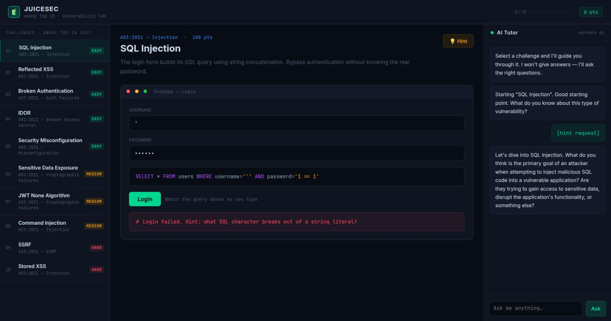

# JuiceSec — OWASP Vulnerability Lab

**An interactive OWASP Top 10 vulnerability lab with an AI tutor. No install. Open a URL and start hacking.**



---

## What it is

Ten browser-based challenges covering the OWASP Top 10 2021. Each simulates a real vulnerability pattern — SQL injection, XSS, IDOR, JWT tampering, SSRF, and more. An AI tutor (Cloudflare Workers AI) coaches you through each challenge using the Socratic method: it asks guiding questions rather than giving answers. When you solve a challenge, it explains the root cause, real-world impact, and fix.

## Challenges

| # | Challenge | OWASP 2021 | Difficulty |
|---|---|---|---|
| 01 | SQL Injection | A03 — Injection | Easy |
| 02 | Reflected XSS | A03 — Injection | Easy |
| 03 | Broken Authentication | A07 — Auth Failures | Easy |
| 04 | IDOR | A01 — Broken Access Control | Easy |
| 05 | Security Misconfiguration | A05 — Misconfiguration | Easy |
| 06 | Sensitive Data Exposure | A02 — Cryptographic Failures | Medium |
| 07 | JWT None Algorithm | A02 — Cryptographic Failures | Medium |
| 08 | Command Injection | A03 — Injection | Medium |
| 09 | SSRF | A10 — SSRF | Hard |
| 10 | Stored XSS | A03 — Injection | Hard |

## Deploy

```bash
npm install -g wrangler
wrangler login
wrangler deploy
```

Local dev:

```bash
wrangler dev   # http://localhost:8787
```

## Architecture

Single Cloudflare Worker (`worker.js`):

```
GET  /        → full HTML/CSS/JS app (self-contained)
POST /tutor   → Cloudflare Workers AI (llama-3.1-8b-instruct)
```

- All challenge logic runs in browser JS — no real attack surface
- AI tutor requires no external API key; billed through Cloudflare Workers AI free tier
- Score and progress tracked in session memory (not persisted)

## Limiting abuse

Before sharing publicly:

1. **Spend cap** — Cloudflare dashboard → Billing → Spending Limits
2. **Rate limit** — Cloudflare dashboard → Security → WAF → Rate Limiting Rules → limit `POST /tutor` to 15 req/min/IP

Workers AI free tier: 10,000 neurons/day. Each tutor response (~350 tokens) costs ~1–2 neurons.

## Part of the Vibe Coding series

→ [mrdee.in/vibecoding](https://mrdee.in/vibecoding)
